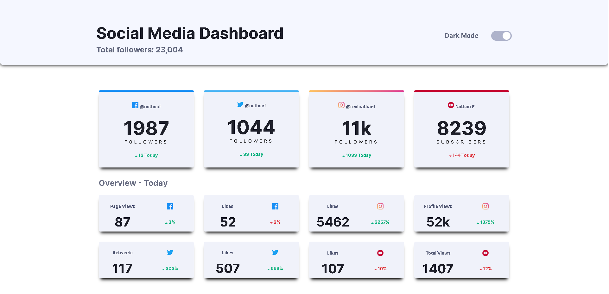
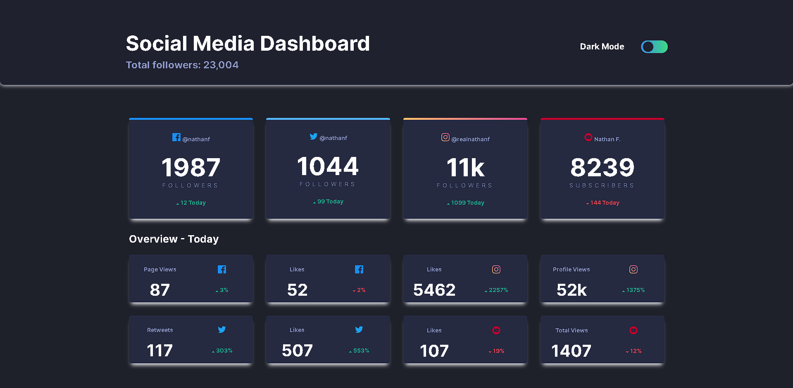

# Social-Media-Dashboard
Uma página que simula um Dashboard para redes sociais com módulo  claro e escuro.

## DETALHES DO PROJETO:
O Objetivo principal do projeto foi desenvolver um 
painel para mídias sociais com design simples 
e a opção de tema claro e escuro com a ativação através 
de um botão, utilizando a linguagem JavaScript para realizar 
a troca do tema.

## Disponível para mobile e desktop.

## Tema claro

## Tema Escuro

## TECNOLOGIAS USADAS NO PROJETO:
* HTML
* CSS
* JavaScript

